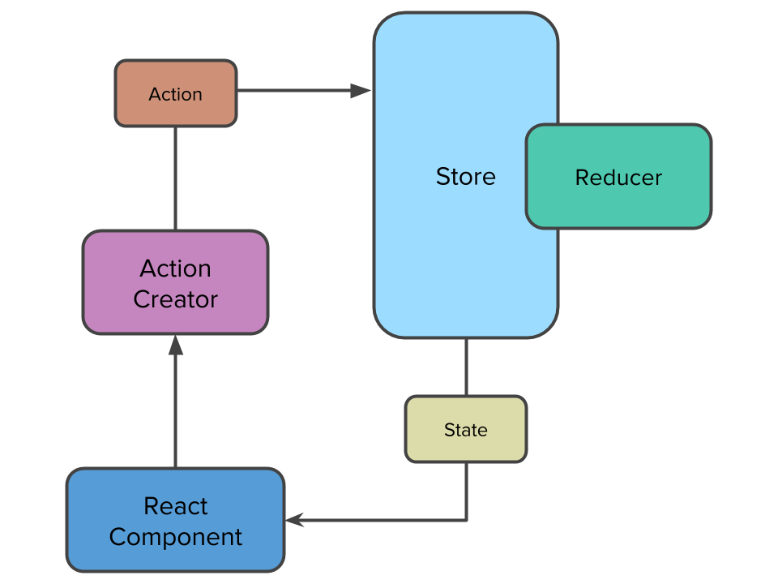

# Redux

Al desarrollar aplicaciones más grandes y complejas con React, surge el problema de tener que manejar diferentes _states_, uno por componente, y pasar _props_ de componentes padres a componentes hijos. Es aquí cuando se hace necesario tener un _state manager_ (o manejador de estados) que centralice todos los cambios de la aplicación y que tenga un _state_ que pueda leerse desde cualquier componente sin necesidad de pasarlo como _props_ de componentes padres a hijos.

[Redux](http://redux.js.org/) es un _state manager_ que centraliza el estado de una aplicación en un contenedor llamado **store**. Para cambiar el _state_ del _store_, Redux provee los **actions**, que son objetos que definen una acción a realizar. Este objeto define un tipo y data adicional relacionada a la acción (que es opcional). Para ejecutar estas acciones, Redux ofrece los **action creators**, que son funciones que retornan _actions_ y se utilizan junto con una función de Redux llamada `dispatch`. Por último, Redux tiene **reducers** que reciben los _actions_ y modifican el _state_ del _store_, según la acción que recibe.

## Actions

Un _action_ es un objeto que define una acción y también puede contener más propiedades relacionadas a la acción.

Por ejemplo, si la acción define “Agregar un elemento de una lista”, también puede contener el elemento que quiere agregar:

```javascript
{
  type: 'ADD_TODO',
  text: 'Aprender Redux'
}
```

> Es recomendable que, en proyectos grandes, los nombres de las acciones se definan en constantes para evitar escribirlas mal en alguna parte de la aplicación.

## Action Creators

Los _action creators_ son funciones que retornan un _action_.

Pueden contener parámetros indicando qué valores asociados al _action_ se van a retornar (como en el caso anterior, donde tenemos el elemento que se quiere agregar):


```javascript
function addTodo(text) {
  return {
    type: 'ADD_TODO',
    text: text
  };
}
```

Un _action creator_ es usado por la función `dispatch` de Redux para enviar dicha acción al _store_.

```javascript
dispatch(addTodo('Aprender Redux'));
```

## Reducers

Los _reducers_ son funciones que toman como argumentos el estado anterior del _store_, y la acción que llega de `dispatch`, y devuelven un nuevo estado.

Al crear un _reducer_ siempre debemos verificar que exista, ya que por defecto el estado es `undefined` la primera vez que el reducer es llamado (a este escenario se le llama **inicialización**). Si no existe se le devuelve un objeto que se llama **estado inicial**.

Luego, se devuelve un nuevo estado según la acción recibida como segundo parámetro:

```javascript
function reducer(state, action) {
  if (typeof state === 'undefined') {
    return initialState;
  }

  if (action.type === 'ADD_TODO') {
    return {
      ...state,
      todos: [
        ...state.todos,
        {
          text: action.text
        }
      ]
    }
  }

  return state;
}
```

## Store

El store se configura una sola vez en la aplicación y debe contener todos los reducers utilizados por la aplicación.

Para crear un store se utiliza la función `createStore` de Redux.

```javascript
import { createStore } from 'redux';
import reducer from './reducer';

const store = createStore(reducer);
```

> Cuando se utiliza más de un _reducer_ en una aplicación, se utiliza la función `combineReducers` para crear un solo _reducer_ que luego pueda ser utilizado por la función `createStore`.

```javascript
import { combineReducers, createStore } from 'redux';
import todosReducer from './reducers/todos';
import notesReducer from './reducers/notes';

const reducer = combineReducers({
  todos: todosReducer,
  notes: notesReducer
});

const store = createStore(reducer);
```

> Usando `combineReducers` el _state_ de la aplicación se divide en pequeñas secciones, definidas en el parámetro que recibe dicha función. Los _reducers_ por defecto solo pueden acceder a esa sección del _state_.

## Redux Lifecycle



El ciclo de vida en Redux empieza cuando un _action creator_ crea una acción, que es disparada por el _dispatcher_ de Redux y es recibida por el _store_ a través de un _reducer_. Este _reducer_ toma el _action_ disparado y, a partir del _state_ anterior, crea un nuevo _state_, que es pasado al componente React.

## Integración con DevTools

Es recomendable utilizar un debugger de Redux, especialmente cuando se trabajan con _state_ complejos en aplicaciones grande.

[Redux DevTools](https://chrome.google.com/webstore/detail/redux-devtools/lmhkpmbekcpmknklioeibfkpmmfibljd) permite inspeccionar el _store_ de una aplicación, incluyendo las acciones que realiza y cómo cambia el _state_ luego de cada acción lanzada.

Para integrar Redux DevTools dentro del _store_ se debe instalar la extensión para Chrome o Firefox y modificar el código de creación del store:

```javascript
import { createStore } from 'redux';

const enhancer = window.__REDUX_DEVTOOLS_EXTENSION__ && window.__REDUX_DEVTOOLS_EXTENSION__();
const store = createStore(reducer, enhancer);
```

## Integración con React

Para poder usar Redux con React necesitamos agregar la biblioteca `react-redux` a nuestra aplicación.

Luego, es necesario encapsular toda la aplicación React en un componente especial de React Redux llamado `<Provider>`. Con `<Provider>`, todos los componentes hijos tienen acceso al _store_ creado previamente con `createStore`. De esta forma, si `App` es el componente raíz de nuestra aplicación, tenemos que usar `<Provider>` de esta forma:

```javascript
import React from 'react';
import { render } from 'react-dom';
import { createStore } from 'redux';
import reducer from './reducer';

const store = createStore(reducer);

render(
  <Provider store={store}>
    <App />
  </Provider>,
  document.getElementById('root')
)
```

El siguiente paso es conectar los componentes de React que utilizarán el _store_ con Redux:

```javascript
const TodoList = ({ items, dispatch }) => (
  <div>
    <button onClick={dispatch(addTodo('Nuevo item'))}>
      Agregar
    </button>
    {items.map(renderItem)}
  </div>
);

const mapStateToProps = state => (
  {
    items: state.items,
  }
);

export default connect(mapStateToProps)(TodoList);
```

React Redux tiene un método `connect` que se encarga de conectar el _store_ de Redux con el componente de React. Cuando un componente de React es conectado a Redux obtiene un _prop_ llamado `dispatch`, que es el encargado de lanzar las acciones al _store_.

`connect` acepta una función que se encarga de mapear partes del _state_ global del _store_ de Redux a _props_ del componente de React.

## Organización de módulos Redux

Redux se compone de varias partes que deben organizarse para poder ser usadas, y reutilizadas, de manera efectiva.

Una forma de organizar los módulos de Redux es utilizando [**Ducks**](https://github.com/erikras/ducks-modular-redux). Un _duck_ es un archivo que contiene todas las partes que utiliza Redux para poder manejar el state de una aplicación.

```javascript
// Actions
const ADD_TODO = 'ADD_TODO';

const initialState = {
  todos: [],
};

// Reducer
export default function reducer(state, action) {
  if (typeof state === 'undefined') {
    return initialState;
  }

  // manejar el state aquí

  return state;
}

// Action Creators
export function addTodo(text) {
  return {
    type: ADD_TODO,
    text: text
  };
}
```

Un _duck_ debe definir los _actions_ en constantes, exportar por defecto el _reducer_ y exportar los _action creators_.